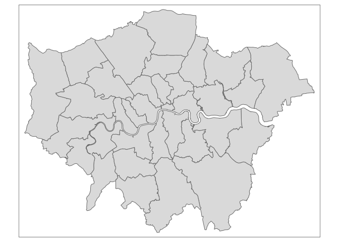
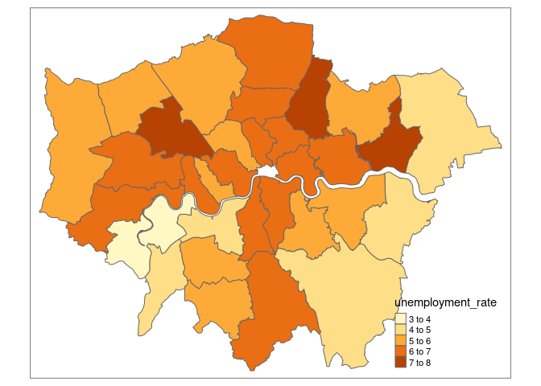

<!-- README.md is generated from README.Rmd. Please edit that file -->

# ukmap

<!-- badges: start -->
<!-- badges: end -->

ukmap provides a wrapper around the ONS (Offce for National Statistics)
[API for UK geospatial data](http://statistics.data.gov.uk/).

## Installation

ukmap is currently in the early stages of development, you can install
it from [GitHub](https://github.com/) with:

``` r
# install.packages("devtools")
devtools::install_github("piersyork/ukmap")
```

## Example

The core function of ukmap is `uk_map()` which takes an area code or
vector of area codes and returns the spatial features map data for the
area. To get the area codes for different area types you can use
`uk_codes()`, which takes an area type code or vector of codes and
returns all the area codes for that area type.

``` r
library(ukmap)

# get map data for london boroughs
london <- uk_codes("E09") |> 
  uk_map()
#>   |                                                                              |                                                                      |   0%  |                                                                              |==                                                                    |   3%  |                                                                              |====                                                                  |   6%  |                                                                              |======                                                                |   9%  |                                                                              |========                                                              |  12%  |                                                                              |===========                                                           |  15%  |                                                                              |=============                                                         |  18%  |                                                                              |===============                                                       |  21%  |                                                                              |=================                                                     |  24%  |                                                                              |===================                                                   |  27%  |                                                                              |=====================                                                 |  30%  |                                                                              |=======================                                               |  33%  |                                                                              |=========================                                             |  36%  |                                                                              |============================                                          |  39%  |                                                                              |==============================                                        |  42%  |                                                                              |================================                                      |  45%  |                                                                              |==================================                                    |  48%  |                                                                              |====================================                                  |  52%  |                                                                              |======================================                                |  55%  |                                                                              |========================================                              |  58%  |                                                                              |==========================================                            |  61%  |                                                                              |=============================================                         |  64%  |                                                                              |===============================================                       |  67%  |                                                                              |=================================================                     |  70%  |                                                                              |===================================================                   |  73%  |                                                                              |=====================================================                 |  76%  |                                                                              |=======================================================               |  79%  |                                                                              |=========================================================             |  82%  |                                                                              |===========================================================           |  85%  |                                                                              |==============================================================        |  88%  |                                                                              |================================================================      |  91%  |                                                                              |==================================================================    |  94%  |                                                                              |====================================================================  |  97%  |                                                                              |======================================================================| 100%

# use the tmap package to easily see what the map data looks like
tmap::qtm(london)
```



You are able to pass the area code column of a dataframe to `uk_map()`
to make the process of getting map data easier.

``` r
london_unemployment <- uk_unemployment |> 
  filter(grepl("^E09", area_code))   # area codes that start E09 are London boroughs

map_data <- uk_map(london_unemployment$area_code) # get the boundaries for the area codes in london_unemployment
#>   |                                                                              |                                                                      |   0%  |                                                                              |==                                                                    |   3%  |                                                                              |====                                                                  |   6%  |                                                                              |=======                                                               |   9%  |                                                                              |=========                                                             |  12%  |                                                                              |===========                                                           |  16%  |                                                                              |=============                                                         |  19%  |                                                                              |===============                                                       |  22%  |                                                                              |==================                                                    |  25%  |                                                                              |====================                                                  |  28%  |                                                                              |======================                                                |  31%  |                                                                              |========================                                              |  34%  |                                                                              |==========================                                            |  38%  |                                                                              |============================                                          |  41%  |                                                                              |===============================                                       |  44%  |                                                                              |=================================                                     |  47%  |                                                                              |===================================                                   |  50%  |                                                                              |=====================================                                 |  53%  |                                                                              |=======================================                               |  56%  |                                                                              |==========================================                            |  59%  |                                                                              |============================================                          |  62%  |                                                                              |==============================================                        |  66%  |                                                                              |================================================                      |  69%  |                                                                              |==================================================                    |  72%  |                                                                              |====================================================                  |  75%  |                                                                              |=======================================================               |  78%  |                                                                              |=========================================================             |  81%  |                                                                              |===========================================================           |  84%  |                                                                              |=============================================================         |  88%  |                                                                              |===============================================================       |  91%  |                                                                              |==================================================================    |  94%  |                                                                              |====================================================================  |  97%  |                                                                              |======================================================================| 100%

map_data |> 
  left_join(london_unemployment, by = "area_code") |> # join london_unemployment to map_data
  tmap::qtm(fill = "unemployment_rate")
```



## TO-DO

-   [ ] Add caching of map data
-   [ ] Fix invalid polygons
-   [ ] Create easy way to merge map data to dataframe containing area
    codes
-   [ ] Find if there is a way to speed up querying boundary data
